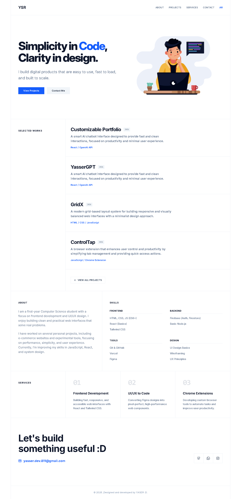

# Modern Developer Portfolio

A sleek, premium, and highly responsive developer portfolio template built with **React**, **Vite**, and **Tailwind CSS**. This project is designed with a minimalist "Swiss-inspired" aesthetic, focusing on clean typography and smooth interactive animations.

## 🚀 Getting Started

This portfolio is designed to be easily customizable. You don't need to dive deep into the code to change your information.

### Customization
1. **Download** the repository to your local machine.
2. Open the file `src/data.json`.
3. Modify the text, project details, skills, and social media links to match your professional profile.
4. The site will automatically update with your new information.

## ✨ Features
- **Data-Driven**: Managed entirely through `data.json`.
- **Multilingual**: Full support for English and Arabic (RTL).
- **Premium UI**: Custom animations, glassmorphism effects, and professional page loaders.
- **Responsive**: Perfectly optimized for mobile, tablet, and desktop.
- **SEO Ready**: Includes sitemap, robots.txt, and optimized meta tags.

---
Built with ❤️ for developers who value design and performance.
